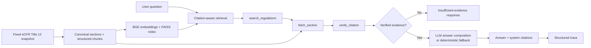

# Legal RAG Agent

[English](README.md) | [简体中文](README.zh-CN.md)

A traceable legal question-answering system for a fixed eCFR Title 12 snapshot.

## Project Summary

Legal RAG Agent demonstrates a verification-first RAG workflow for financial regulation research. It retrieves section-level evidence from a fixed `2025-09-01` eCFR Title 12 snapshot, fetches the corresponding full sections, verifies citation metadata, and only then composes an answer.

The language model is used as an answer composer rather than an authority selector. Final citations are produced from verified sections by the system, and each run emits a structured trace for inspecting retrieval, tool calls, evidence, verification results, and termination status.

This repository is a technical prototype, not a real-time legal research service or legal advice.

## Highlights

- **Fixed legal corpus** — versioned eCFR Title 12 snapshot dated `2025-09-01`
- **Citation-aware retrieval** — explicit CFR references, one-hop cross-references, and BGE Large + FAISS semantic retrieval
- **Read-only legal tools** — `search_regulations`, `fetch_section`, and `verify_citation`
- **Verified answer path** — the model receives only evidence that passed section, version, URL, and citation-safety checks
- **System-controlled citations** — the LLM does not choose the final authority list
- **Inspectable execution** — JSON traces record steps, evidence, fetched sections, verification results, and final output
- **Graceful fallback** — deterministic output is returned when the optional LLM call fails
- **Multiple evaluation layers** — retrieval, Agent process, and LLM-as-Judge evaluation
- **Application interfaces** — CLI and FastAPI endpoints for asking questions and reading traces
- **Test coverage** — latest local run: `154 passed`

## Architecture



The runtime is intentionally bounded and inspectable. Tool selection follows a deterministic workflow rather than an open-ended planner, which keeps the legal evidence path easy to test and review.

## Agent Workflow

| Step | Component | Responsibility |
|---:|---|---|
| 1 | `search_regulations` | Retrieve candidate evidence using citation-aware search |
| 2 | `fetch_section` | Load the full text and metadata for selected sections |
| 3 | `verify_citation` | Check section existence, snapshot date, source URL, and citation safety |
| 4 | Answer composer | Generate a concise answer from verified evidence only |
| 5 | Trace writer | Persist the run state, evidence summary, citations, and termination reason |

The Agent stops with an insufficient-evidence result when no valid citation survives verification. When an OpenAI-compatible answer model is enabled, the model is constrained to the verified evidence and allowed citation list.

## Evaluation

The project evaluates three different parts of the system rather than collapsing them into one score:

| Layer | What it measures |
|---|---|
| Retrieval | Whether the expected regulation sections appear in the retrieved context |
| Agent process | Whether the expected search, fetch, verify, and answer steps complete correctly |
| Answer quality | Relevance, faithfulness, citation support, legal caution, and overall quality via an external LLM judge |

### Development retrieval results

The committed development report contains 20 questions. The citation-aware `full_context` strategy combines explicit citation priority with one-hop cross-reference expansion.

| Variant | Hit@1 | Hit@5 | Hit@10 | Recall@10 | MRR@10 |
|---|---:|---:|---:|---:|---:|
| Semantic baseline | 0.400 | 0.800 | 0.900 | 0.925 | 0.566 |
| Citation-aware full context | 0.800 | 0.950 | 1.000 | 1.000 | 0.863 |

These results are from a small development split and should not be interpreted as broad legal QA generalization. See [`reports/title12_context_retrieval_eval.md`](reports/title12_context_retrieval_eval.md) for the full breakdown and failure analysis.

LLM-as-Judge is treated as an auxiliary signal, not ground truth. A stronger external judge should be independent from the answer model.

## Quickstart

### 1. Install dependencies

```bash
git clone https://github.com/WangChen-Clara/legal-rag-agent.git
cd legal-rag-agent

python -m venv .venv
python -m pip install -r requirements.environment.txt
```

Activate the environment using the command for your platform, then expose the `src` directory:

```bash
# macOS / Linux
export PYTHONPATH="$PWD/src"
```

```powershell
# Windows PowerShell
$env:PYTHONPATH = "$PWD/src"
```

### 2. Prepare runtime assets

Large generated assets are intentionally excluded from the public repository. Place them at the default locations below, or pass custom paths through CLI options or API environment variables.

```text
models/bge-large-en-v1.5/
data/indexes/title12_bge_large_2025-09-01/vector_db.index
data/indexes/title12_bge_large_2025-09-01/metadata.npy
data/canonical/title12_2025-09-01/sections.jsonl
```

The repository can still run its offline unit tests without these production assets:

```bash
python -m pytest -q -p no:cacheprovider
```

## CLI Demo

Run the verified Agent with deterministic answer fallback:

```bash
python scripts/ask_agent.py \
  "What does 12 CFR 211.31 apply to?" \
  --device cpu
```

Enable an OpenAI-compatible local answer model, such as an Ollama-served model:

```bash
python scripts/ask_agent.py \
  "What does 12 CFR 211.31 apply to?" \
  --device cpu \
  --use-llm \
  --llm-base-url http://localhost:11434/v1 \
  --llm-model qwen2.5:7b-instruct \
  --llm-api-key ollama
```

The CLI prints the answer, final citations, fetched sections, citation-verification status, top evidence, termination reason, and trace path.

## API Demo

Start the FastAPI service:

```bash
export PYTHONPATH="$PWD/src"
export RAG_LAW_USE_LLM=true
python -m uvicorn rag_law.api:app --host 127.0.0.1 --port 8000
```

Windows PowerShell:

```powershell
$env:PYTHONPATH = "$PWD/src"
$env:RAG_LAW_USE_LLM = "true"
python -m uvicorn rag_law.api:app --host 127.0.0.1 --port 8000
```

Ask a question:

```bash
curl -X POST http://127.0.0.1:8000/ask \
  -H "Content-Type: application/json" \
  -d '{"question":"What does 12 CFR 211.31 apply to?"}'
```

Read a saved trace:

```bash
curl http://127.0.0.1:8000/trace/<trace_id>
```

Available endpoints:

```text
GET  /health
POST /ask
GET  /trace/{trace_id}
```

## Security

- Never commit API keys or local `.env` files.
- Pass credentials through process environment variables or a secret manager.
- Keep `.env.example` limited to variable names and safe defaults.
- Retrieval and legal-data tools are read-only by default.
- Generated corpora, indexes, traces, and bulky reports remain local unless deliberately curated for release.

See [`SECURITY.md`](SECURITY.md) for the repository security notes.

## Limitations

- The system is tied to the `2025-09-01` eCFR Title 12 snapshot and does not represent current law.
- The public repository excludes the corpus, embedding model, FAISS index, and generated evaluation data.
- The committed retrieval evaluation uses a small 20-question development set.
- LLM-as-Judge is an auxiliary evaluation method and may contain model bias.
- Tool selection is deterministic; the Agent does not currently use an LLM planner.
- Citation verification checks metadata consistency and citation safety, not legal interpretation.
- The project is a research and engineering prototype and does not provide legal advice.
