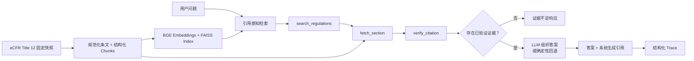

# Legal RAG Agent

[English](README.md) | [简体中文](README.zh-CN.md)

一个面向 eCFR Title 12 固定快照的可追溯法律问答系统。

## 项目概述

Legal RAG Agent 展示了一套“先验证证据，再生成答案”的法规 RAG 工作流。系统基于 `2025-09-01` 的 eCFR Title 12 固定快照进行条款级检索，读取对应完整法规条文，核验引用元数据，最后再组织答案。

语言模型只负责基于已验证证据生成自然语言回答，不负责决定应当引用哪些法律依据。最终引用由系统从通过验证的条款中生成；每次运行还会输出结构化 Trace，用于复查检索结果、工具调用、证据、引用验证和终止状态。

本仓库是一个技术原型，不是实时法律检索服务，也不构成法律建议。

## 核心亮点

- **固定法规语料**：使用日期为 `2025-09-01` 的 eCFR Title 12 版本快照
- **引用感知检索**：结合显式 CFR 条款识别、单跳交叉引用扩展和 BGE Large + FAISS 语义检索
- **只读法律工具**：`search_regulations`、`fetch_section`、`verify_citation`
- **验证后生成**：仅将通过条款、版本、来源 URL 和引用安全性检查的证据交给模型
- **系统控制引用**：最终法律依据列表不由 LLM 自由生成
- **可复查执行过程**：JSON Trace 记录步骤、证据、完整条文、验证结果和最终输出
- **失败回退机制**：可选 LLM 调用失败时返回确定性结果
- **分层评测**：分别评估检索、Agent 流程和答案质量
- **应用接口**：提供 CLI、FastAPI 问答接口和 Trace 查询
- **测试覆盖**：最近一次本地测试结果为 `154 passed`

## 系统架构



运行流程有明确步数边界，并且可以逐步检查。当前工具选择采用确定性工作流，而不是开放式 LLM Planner，因此更容易测试、复现和审计法律证据链。

## Agent 工作流

| 步骤 | 组件 | 职责 |
|---:|---|---|
| 1 | `search_regulations` | 使用引用感知检索召回候选法规证据 |
| 2 | `fetch_section` | 读取选中条款的完整正文和元数据 |
| 3 | `verify_citation` | 检查条款是否存在、快照日期、来源 URL 和引用安全性 |
| 4 | Answer Composer | 仅基于已验证证据生成简洁回答 |
| 5 | Trace Writer | 保存运行状态、证据摘要、引用和终止原因 |

如果没有任何引用通过验证，Agent 会以证据不足结束。当启用 OpenAI-compatible 答案模型时，模型只能使用系统提供的已验证证据和允许引用列表。

## 评测

项目将评测拆成三个层级，而不是用单一分数概括整个系统：

| 层级 | 评测内容 |
|---|---|
| 检索评测 | 预期法规条款是否出现在召回结果中 |
| Agent 流程评测 | Search、Fetch、Verify 和 Answer 步骤是否按预期执行 |
| 答案质量评测 | 使用外部 LLM Judge 评估相关性、忠实度、引用支撑、法律谨慎性和整体质量 |

### Development 检索结果

仓库中保留的 Development 报告包含 20 个问题。`full_context` 引用感知策略结合了显式引用优先和单跳交叉引用扩展。

| 策略 | Hit@1 | Hit@5 | Hit@10 | Recall@10 | MRR@10 |
|---|---:|---:|---:|---:|---:|
| 语义检索基线 | 0.400 | 0.800 | 0.900 | 0.925 | 0.566 |
| 引用感知 Full Context | 0.800 | 0.950 | 1.000 | 1.000 | 0.863 |

这些结果来自小规模 Development Split，不能被解读为对广泛法律问答能力的证明。完整结果和失败案例见 [`reports/title12_context_retrieval_eval.md`](reports/title12_context_retrieval_eval.md)。

LLM-as-Judge 仅作为辅助信号，不是 Ground Truth。正式评测应使用与 Answer Model 相互独立、能力更强的外部 Judge。

## 快速开始

### 1. 安装依赖

```bash
git clone https://github.com/WangChen-Clara/legal-rag-agent.git
cd legal-rag-agent

python -m venv .venv
python -m pip install -r requirements.environment.txt
```

根据操作系统激活虚拟环境，然后将 `src` 加入 `PYTHONPATH`：

```bash
# macOS / Linux
export PYTHONPATH="$PWD/src"
```

```powershell
# Windows PowerShell
$env:PYTHONPATH = "$PWD/src"
```

### 2. 准备运行资产

体积较大的生成资产不会提交到公开仓库。请将它们放到以下默认路径，或者通过 CLI 参数、API 环境变量指定自定义位置。

```text
models/bge-large-en-v1.5/
data/indexes/title12_bge_large_2025-09-01/vector_db.index
data/indexes/title12_bge_large_2025-09-01/metadata.npy
data/canonical/title12_2025-09-01/sections.jsonl
```

即使没有这些运行资产，仍可执行不依赖真实模型和索引的离线单元测试：

```bash
python -m pytest -q -p no:cacheprovider
```

## CLI 演示

使用确定性答案回退运行已验证 Agent：

```bash
python scripts/ask_agent.py \
  "What does 12 CFR 211.31 apply to?" \
  --device cpu
```

启用 OpenAI-compatible 本地答案模型，例如通过 Ollama 提供的模型：

```bash
python scripts/ask_agent.py \
  "What does 12 CFR 211.31 apply to?" \
  --device cpu \
  --use-llm \
  --llm-base-url http://localhost:11434/v1 \
  --llm-model qwen2.5:7b-instruct \
  --llm-api-key ollama
```

CLI 会输出答案、最终引用、读取的完整条款、引用验证状态、Top Evidence、终止原因和 Trace 路径。

## API 演示

启动 FastAPI 服务：

```bash
export PYTHONPATH="$PWD/src"
export RAG_LAW_USE_LLM=true
python -m uvicorn rag_law.api:app --host 127.0.0.1 --port 8000
```

Windows PowerShell：

```powershell
$env:PYTHONPATH = "$PWD/src"
$env:RAG_LAW_USE_LLM = "true"
python -m uvicorn rag_law.api:app --host 127.0.0.1 --port 8000
```

发起问答请求：

```bash
curl -X POST http://127.0.0.1:8000/ask \
  -H "Content-Type: application/json" \
  -d '{"question":"What does 12 CFR 211.31 apply to?"}'
```

读取已保存的 Trace：

```bash
curl http://127.0.0.1:8000/trace/<trace_id>
```

可用接口：

```text
GET  /health
POST /ask
GET  /trace/{trace_id}
```

## 安全说明

- 不要提交 API Key 或本地 `.env` 文件。
- 通过进程环境变量或 Secret Manager 传递凭证。
- `.env.example` 只保留变量名和安全的默认值。
- 法规检索与数据工具默认只读。
- 生成的语料、索引、Trace 和大体积报告默认保留在本地，仅在整理后有选择地公开。

更多说明见 [`SECURITY.md`](SECURITY.md)。

## 当前限制

- 系统绑定 `2025-09-01` 的 eCFR Title 12 固定快照，不能代表现行法律。
- 公开仓库不包含法规语料、Embedding Model、FAISS Index 和生成的评测数据。
- 已提交的检索评测仅使用 20 个 Development 问题。
- LLM-as-Judge 可能存在模型偏差，只能作为辅助评测方法。
- 工具选择目前是确定性的，尚未使用 LLM Planner。
- Citation Verification 验证的是元数据一致性与引用安全性，不判断法律解释是否正确。
- 本项目是研究与工程原型，不提供法律建议。
