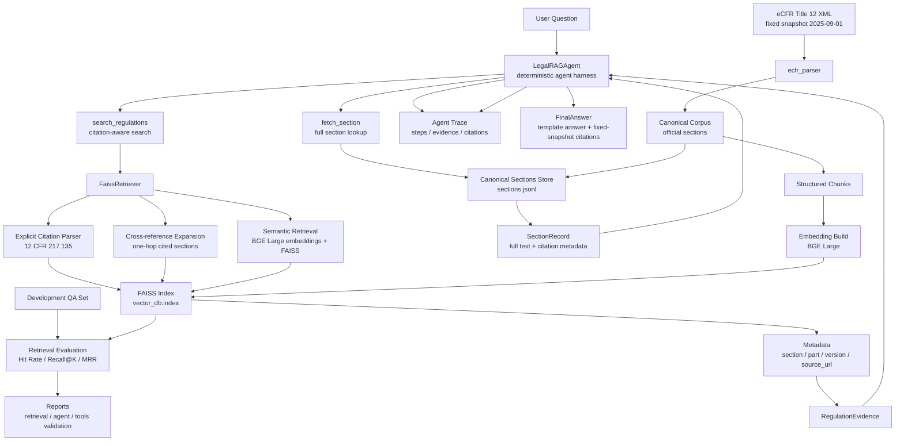

# Architecture

The system is a CLI-first Legal RAG Agent over a fixed eCFR Title 12 snapshot.
User questions enter a deterministic `LegalRAGAgent`, which calls read-only tools
for citation-aware retrieval and full-section lookup. Retrieval combines explicit
CFR citation matching, one-hop cross-reference expansion, and BGE Large + FAISS
semantic search. The agent returns a template-based cited answer and a structured
trace that records tool calls, retrieved evidence, fetched sections, and final
citations.

The data pipeline starts from the fixed `2025-09-01` eCFR Title 12 XML snapshot.
The parser builds canonical section records, the chunk builder produces structured
retrieval chunks, and the embedding/indexing step creates the FAISS runtime index.
Development QA data and validation scripts are used to report retrieval metrics
and validate the tool and agent flows.
