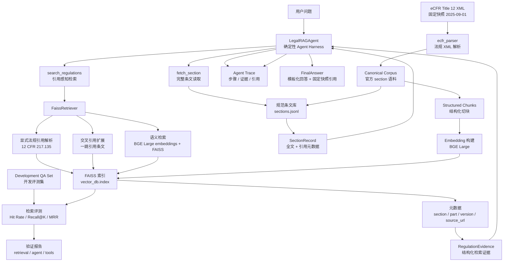

# 架构图

这个项目是一个面向 eCFR Title 12 固定快照的 Legal RAG Agent 原型。用户问题先进入
确定性的 `LegalRAGAgent`，Agent 调用只读工具完成引用感知检索和完整条文读取。检索层
由三部分组成：显式 `12 CFR xxx` 引用优先召回、一跳交叉引用扩展，以及 BGE Large +
FAISS 语义检索。Agent 最终输出带固定快照 citation 的模板化回答，并记录结构化 trace，
包括工具调用步骤、检索证据、读取的完整条文和最终引用。

数据管线从 `2025-09-01` 的 eCFR Title 12 XML 固定快照开始。解析器先生成官方 section
级规范语料，随后结构化切块用于向量检索，embedding/indexing 步骤生成 FAISS 运行索引。
Development QA 数据和验证脚本用于计算 Hit Rate、Recall@K、MRR 等检索指标，并验证工具层
和 Agent 流程是否符合预期。
